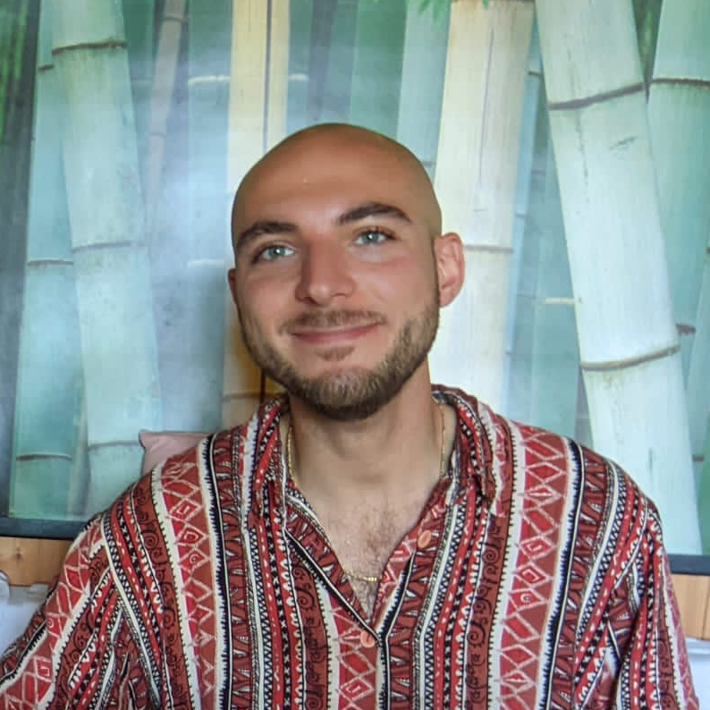

 
 

<!--## About me-->
PhD candidate at the [Institute for Logic, Language and Computation](https://www.illc.uva.nl) of the [University of Amsterdam](https://www.uva.nl/en), I work in the [Dialogue Modelling Group](https://dmg-illc.github.io/dmg/) under the supervision of [Raquel Fernández](https://staff.fnwi.uva.nl/r.fernandezrovira/) and together with many amazing colleagues. My research interest lie in the following areas, which roughly define the boundaries of my projects and publications:
- Computational semantics and pragmatics
- Computational dialogue modelling
- Natural Language Generation 
- Language variation and change in communities of speakers
- Explainability, interpretability, and fair evaluation of NLP models

What I am most excited about is studying human strategies of communication using computational models of language understanding and generation. This is the main topic of my PhD, which I address with machine learning, information theory, and statistical modelling.

<!-- I analyse and model language production and comprehension with computational methods. My main research goal is defining empirical measures of human-likeness that can be used (i) to evaluate the alignment of machine-generated utterances to human communication patterns and strategies, and (ii) to develop NLG models that more closely follow such patterns and strategies. I am also interested in psycholinguistic and sociolinguistic studies of variation and change as they provide insights into how to build more resilient and human-compatible language technologies.-->

##### It's-a me, Mario  
Born and raised in Italy, I spent three years in Germany as a undergraduate student of Computational Linguistics at the [University of Tübingen](https://uni-tuebingen.de/en/) and then moved to Amsterdam for a Master's degree in Artificial Intelligence. 
During my Bachelor's studies, I worked both as a teaching and as a research assistant for the [Department of General and Computational Linguistics](https://uni-tuebingen.de/en/faculties/faculty-of-humanities/departments/modern-languages/department-of-linguistics/), and I served a five-month internship in the IBM department for social media analytics.
As a Master's student, I have collected more teaching and research experience, collaborating with an interdisciplinary set of [ILLC](https://www.illc.uva.nl) scholars and students. I graduated with a thesis on the detection and analysis of lexical semantic change.
<!--
In July 2017 I graduated with a thesis that proposes [new methods](https://arxiv.org/abs/1708.03910) for the analysis of affective text.
Currently I study Artificial Intelligence at the University of Amsterdam.    
-->

## News
- New preprint on _State-of-the-art generalisation research in NLP: A taxonomy and review_ [[PDF](https://arxiv.org/abs/2210.03050)]
- New paper at EMNLP 2022: _Towards Pragmatic Production Strategies for Natural Language Generation_. [[PDF](https://arxiv.org/abs/2210.12828)]
- New paper at AACL-IJCNLP 2022 with Arabella Sinclair and Raquel Fernández: _Construction Repetition Reduces Information Rate in Dialogue_. [[PDF](https://arxiv.org/abs/2210.08321)]
- Oral presentations at [CLIN](https://clin2022.uvt.nl) and [CLiC-it](https://clic2021.disco.unimib.it).
- New interpretability paper with Sam Ryb at *SEM 2022.
- New paper at the [LChange'22](https://languagechange.org/events/2022-acl-lchange/) ACL Workshop with Andrey Kutuzov and Lidia Pivovarova.
- New paper at EMNLP-2021 with Arabella Sinclair and Raquel Fernández.
- Two new papers at CONLL-2021 with Raquel Fernández, Andrey Kutuzov and Lidia Pivovarova.
- Three tasks (with new datasets) accepted for the [BIG-bench](https://github.com/google/BIG-bench) collaborative benchmark, thanks to an amazing team of students and researchers brought together by the [Amsterdam ELLIS unit](https://ivi.fnwi.uva.nl/ellis/2021/04/19/first-amsterdam-ellis-team-participates-in-challenge/).
- Excited to co-organise the fourth edition of the [BlackboxNLP](https://blackboxnlp.github.io) workshop, which will take place on November 11th at EMNLP.
 
## Invited talks
- Language Technology Research Lab. University of Gothenburg. **November 2022**. Sweden.
- Inria & Loria. 27 October 2022. Nancy, France. [[Abstract](https://www.loria.fr/event/department-4-seminar-mario-giulianelli/)]
- School of Natural and Computing Sciences. University of Aberdeen. 12 October 2022. Scotland, UK. [[Abstract](https://www.abdn.ac.uk/ncs/seminars/17943/)]
- Advanced Information Retrieval (MSc AI and Informatics). University of Amsterdam. 21 September 2022. [[Slides](grounded_dialogue_modelling_21sept2022.pdf)]
- [Language Technology Group Seminar](https://www.mn.uio.no/ifi/english/research/groups/ltg/research-seminar/). Language Technology Group. University of Oslo, Norway. 14 March 2022.
- NLPitch. Institute for Logic, Language and Computation. University of Amsterdam, Netherlands. 26 October 2020.
- AILC Lectures on Computational Linguistics. Università Tor Vergata. Rome, Italy. 17 June 2021.
- Cognitive Machine Learning Lab. Ecole Normale Supérieure. Paris, France. 29 June 2021.
- Symposium on Meaning Variation in Social Contexts. Institute for Logic, Language and Computation. Amsterdam, NL. 5 November 2020.
- Computational Linguistic Seminar. Institute for Logic, Language and Computation. University of Amsterdam, Netherlands. 5 October 2021.
- NLP 1 (MSc AI course). University of Amsterdam, Netherlands. Online. 18 November 2020.
- Cognitive Science & Artificial Intelligence PhD Group. Tilburg, Netherlands. 1 May 2020.
- Cool Logic Seminar. Amsterdam, Netherlands. 1 February 2019.

## My work
- [[PDF](https://arxiv.org/abs/2210.12828)] Mario Giulianelli. 2022. **Towards Pragmatic Production Strategies for Natural Language Generation**. To appear in _Proceedings of the 2022 Conference on Empirical Methods in Natural Language Processing (EMNLP 2022)_
- [[PDF](https://arxiv.org/abs/2210.03050)] Dieuwke Hupkes, Mario Giulianelli, Verna Dankers, Mikel Artexte, Tiago Pimentel, et al. 2022. **State-of-the-art generalisation research in NLP: A taxonomy and review**. Preprint.
- [[PDF](https://arxiv.org/abs/2210.08321)] Mario Giulianelli, Arabella Sinclair, Raquel Fernández. 2022. **Construction Repetition Reduces Information Rate in Dialogue**. To appear in _Proceedings of the 2nd Conference of the Asia-Pacific Chapter of the Association for Computational Linguistics and the 12th International Joint Conference on Natural Language Processing (AACL-IJCNLP 2022)_.
- [[PDF](https://aclanthology.org/2022.lchange-1.6/)] Mario Giulianelli, Andrey Kutuzov, Lidia Pivovarova. 2022. **Do Not Fire the Linguist: Grammatical Profiles Help Language Models Detect Semantic Change**. In _Proceedings of the 3rd Workshop on Computational Approaches to Historical Language Change_.
- [[PDF](https://aclanthology.org/2022.starsem-1.5/)][[Dataset](https://github.com/dmg-illc/analog)] Samuel Ryb, Mario Giulianelli, Arabella Sinclair, Raquel Fernández. 2022. **AnaLog: Testing Analytical and Deductive Logic Learnability in Language Models**. In _Proceedings of *SEM 2022: The 11th Joint Conference on Lexical and Computational Semantics_.
- [[PDF](https://arxiv.org/abs/2206.04615)] With many collaborators :). 2022. **Beyond the Imitation Game: Quantifying and Extrapolating the Capabilities of Language Models**. ArXiV, Computation and Language.
- [[PDF](https://aclanthology.org/2021.emnlp-main.652/)][[Code](https://github.com/dmg-illc/uid-dialogue)] Mario Giulianelli, Arabella Sinclair, Raquel Fernández. 2021. **Is Information Density Uniform in Task-Oriented Dialogues?** In _Proceedings of the 2021 Conference on Empirical Methods in Natural Language Processing (EMNLP 2021)_.
- [[PDF](https://aclanthology.org/2021.conll-1.50/)][[Code](https://github.com/dmg-illc/uid-dialogue)] Mario Giulianelli and Raquel Fernández. 2021. **Analysing Human Strategies of Information Transmission as a Function of Discourse Context**. In _Proceedings of the 25th Conference on Computational Natural Language Learning (CONLL 2021)_.
- [[PDF](https://aclanthology.org/2021.conll-1.33/)][[Code](https://github.com/glnmario/semchange-profiling)] Mario Giulianelli, Andrey Kutuzov, Lidia Pivovarova. 2021. **Grammatical Profiling for Semantic Change Detection**. In _Proceedings of the 25th Conference on Computational Natural Language Learning (CONLL 2021)_.
- [[PDF](https://www.aclweb.org/anthology/2020.acl-main.365/)][[Code](https://github.com/glnmario/cwr4lsc)] Mario Giulianelli, Marco Del Tredici, Raquel Fernández. 2020. **Analysing Lexical Semantic Change with Contextualised Word Representations**. _Proceedings of the 58th Annual Meeting of the Association for Computational Linguistics (ACL 2020)_.
- [[PDF](https://arxiv.org/abs/2005.00050)][[Code](https://github.com/akutuzov/semeval2020)] Andrey Kutuzov and Mario Giulianelli. 2020. **UiO-UvA at SemEval-2020 Task 1: Contextualised Embeddings for Lexical Semantic Change Detection**. In the _Proceedings of the 14th International Workshop on Semantic Evaluation (SemEval 2020)_.
- [[PDF](https://www.aclweb.org/anthology/2020.emnlp-main.353/)][[Code](https://github.com/dmg-photobook/ref-gen-photobook)] Ece Takmaz, Mario Giulianelli, Sandro Pezzelle, Arabella Sinclair, Raquel Fernández. 2020. **Refer, Reuse, Reduce: Generating Subsequent References in Visual and Conversational Contexts**. In _Proceedings of the 2020 Conference on Empirical Methods in Natural Language Processing (EMNLP 2020)_.
- [[PDF](https://arxiv.org/abs/1808.08079)][[Code](https://github.com/glnmario/under-the-hood)] Mario Giulianelli, Jacqueline Harding, Florian Mohnert, Dieuwke Hupkes, Willem Zuidema. 2018. **Under the Hood: Using Diagnostic Classifiers to Investigate and Improve how Language Models Track Agreement Information**. _Best Paper Award at 1st Workshop on Analyzing and Interpreting Neural Networks for NLP (EMNLP 2018)_.
- [[PDF](https://clinjournal.org/clinj/article/view/82)][[Code](https://github.com/glnmario/emo2vec)] Mario Giulianelli and Daniel de Kok. 2018. **Semi-supervised emotion lexicon expansion with label propagation**. _Computational Linguistics in the Netherlands Journal 8 (CLIN)_.

*Not peer-reviewed*
- [[PDF](mscthesis.pdf)] Lexical Semantic Change Analysis with Contextualised Word Representations. 2019. _Master's thesis._
- [[PDF](https://arxiv.org/pdf/1708.03910.pdf)] Semi-supervised emotion lexicon expansion with label propagation and specialized word embeddings. 2017. _Bachelor's thesis._ 
- Measuring alignment in conversations across topics and linguistic markers.
- Evaluating the syntactic competence of RAN language models.
- Extraction of event graphs from Kafka’s short stories.   
  Automatic annotation of emotional events and temporal relations.
- Response time of German native speakers reacting to different types of foreign mispronunciations. 
- Sentiment analysis, demographic information extraction, behaviour analysis, and users interests extraction
 on Italian texts. _At IBM Watson Analytics for Social Media_.

<!-- ## Presentations
- **Talk.** 7 July 2020. [[Video](https://slideslive.com/38929048/analysing-lexical-semantic-change-with-contextualised-word-representations)] Analysing Lexical Semantic Change with Contextualised Word Representations. _ACL 2020_. Online.
- **Symposium.** 18 May 2020. [[PDF](gecko-poster-slides.pdf)] Analysing Lexical Semantic Change with Contextualised Word Representations. _GeCKo 2020_. Online.
- **Guest talk.** 1 May 2020. Evaluating the human-likeness of language model representations. _Cognitive Science & Artificial Intelligence_. Tilburg, Netherlands.
- **Poster.** 11 October 2019. [[PDF](EurNLP.pdf)] Contextualised Word Representations for Lexical Semantic Change Analysis. _EurNLP_. London, UK.
- **Poster.** 30 August 2019. Contextualised Word Representations for Lexical Semantic Change Analysis. _Interacting Minds_. Egmond aan Zee, Netherlands.
- **Talk.** 1 February 2019. Diagnostic Classifiers for Language Models. _Cool Logic Seminar - Institute for Logic, Language and Computation_, Amsterdam, Netherlands.
- **Talk.** 1 November 2018. Under the Hood: Using Diagnostic Classifiers to Investigate and Improve how Language Models Track Agreement Information, EMNLP 2018, _[BlackboxNLP](https://blackboxnlp.github.io) Workshop on Analyzing and Interpreting Neural Networks for NLP_, Brussels, Belgium.
- **Talk.** 26 January 2018. [[PDF](CLIN28.pdf)] Semi-supervised emotion lexicon expansion with label propagation, [CLIN](http://clin28.cls.ru.nl/#abstract-49) 2018, Nijmegen, Netherlands. -->

<!--
## GitHub
- [under-the-hood](https://github.com/Procope/under-the-hood/blob/master/README.md): using diagnostic classifiers to investigate and improve how language models process subject-verb agreement.
- [emo2vec](https://github.com/Procope/emo2vec/blob/master/README.md): expand an emotion lexicon via label propagation and learn emotion-specific word embeddings from an annotated corpus. 
-->

<!--**Email**: [m.giulianelli@uva.nl](mailto:m.giulianelli@uva.nl)-->
<!--**GitHub**: [github.com/glnmario](https://github.com/glnmario)-->
<!--**LinkedIn**: [linkedin/mario-giulianelli](https://www.linkedin.com/in/mario-giulianelli) -->

> The only way to predict the future is to invent it.      

